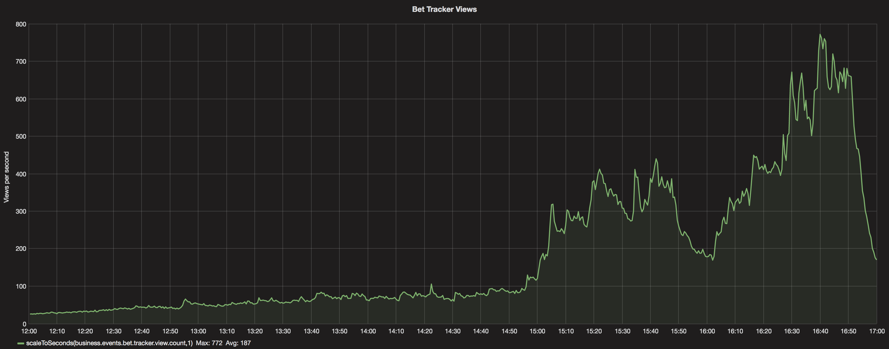

# Metrics

So now for the side-effects! Implementing metrics is our first real break from trying to build our pure ivory tower of FP. By their very nature, metrics require us to maintain some concept of state and introduce side-effects to our applications.

Fear not, however, the application structure we have come to know and love allows us to decorate our lovely, declarative, pure computations with the imperative, side-effecty business of reporting just what's going on under the surface. 

## Why Do You Need Metrics When You Have Logs?

From Cindy Sridharan's article [Logs and Metrics](https://medium.com/@copyconstruct/logs-and-metrics-6d34d3026e38):

> Since metrics are just numbers measured over intervals of time, they can be compressed, stored, processed and retrieved far more efficiently than logs representing plaintext records or JSON blobs. Metrics are optimized for storage and enable longer retention of data, which can in turn be used to build dashboards to reflect historical trends. Additionally, metrics better allow for gradual reduction of data resolution over time, so that after a certain period of time data can be aggregated into daily or weekly frequency.

Metrics give you a great way to introduce observability into your app without necessarily incurring the overhead of shipping, storing and processing logs. For example, if your traffic scales dramatically, typically your metrics data rate stays constant (just the numbers it's reporting are different). However, if your traffic scales dramatically, chances are your log volume will scale proportionally with the traffic. This can get difficult to manage (disk's filling up and causing issues) and potentially very expensive (depending on the hardward and licensing costs of your log aggregation and processing etc.).



## Core Metrics

### Counter

```JavaScript
// increment or reset only
const requestCount = new client.Counter({
  name: 'fixturesAPIRequests',
  help: 'Count of all requests handled',
});

requestCount.inc(); // Only supports counting up (or being reset)
```


### Guage

```JavaScript
// increment, decrement or reset
const requestGauge = new client.Gauge({
  name: 'fixturesAPIActiveRequests',
  help: 'Shows the current number of requests being processed',
});

requestGauge.inc(); // increases the count
reuestGauge.dec(); // decreases the count!
```

### Histogram

```JavaScript
// tracks size and frequency of events
const responseTimerH = new client.Histogram({
  name: 'fixturesAPIResponseDuration',
  help: 'Breaks down the length of time required to handle a request',
});

const end = responseTimerH.startTimer();
// some time later
end();
```

### Summary

```JavaScript
// Calculates percentiles of observed values
const responseTimerS = new client.Summary({
  name: 'fixturesAPIResponseDuration',
  help: 'Breaks down the length of time required to handle a request',
});

const end = responseTimerS.startTimer();
// some time later
end();
```

### Default metrics

```JavaScript
// will poll the system at the rate specified to report underlying system metrics
client.collectDefaultMetrics({ timeout: 5000 });
```

## Going beyond the basics

Different runtime environments offer different solutions for metrics. For some systems (e.g. Prometheus) where scraping is the default method of ingesting metrics, there's some consideration required around how to get metrics from individual instances (aka processes) of your app. This is beyond the scope of this workshop but it's worth taking some time to learn about this by yourself.

Other systems (for example statsd) will not have the same issues for multiple processes as, by default, you are pushing metrics to a single collection agent from each individual process. This does have the drawback, however, of introducing the same sort of scaling overhead (though on a lesser scale) as logging. Basically, the more traffic your app handles, the more calls to statsd you'll make.

## Exercises

1. Add a counter to your API to monitor the total number of requests received
1. Add a guage to your API to monitor the number of currently active requests
1. Add a histogram to your API to monitor the average duration of processing a request
1. Expose the metrics to the world! *(hint: `if (pathname === "/metrics") { }` is a good start)*

## Further Reading

* [prom-client](https://www.npmjs.com/package/prom-client)
* [Logs and metrics](https://medium.com/@copyconstruct/logs-and-metrics-6d34d3026e38)
* [The RED Method](https://thenewstack.io/monitoring-microservices-red-method/)
* [The RED Method (video)](https://www.youtube.com/watch?v=TJLpYXbnfQ4)
* [Prometheus](https://prometheus.io/)
* [statsd](https://github.com/etsy/statsd)
* [Graphite](https://graphiteapp.org/)
* [Grafana](https://grafana.com/)
* [telegraf](https://www.influxdata.com/time-series-platform/telegraf/)
* [pagerduty](https://www.pagerduty.com/)
 
Next - [circuit breakers](./circuit-breaker.md)